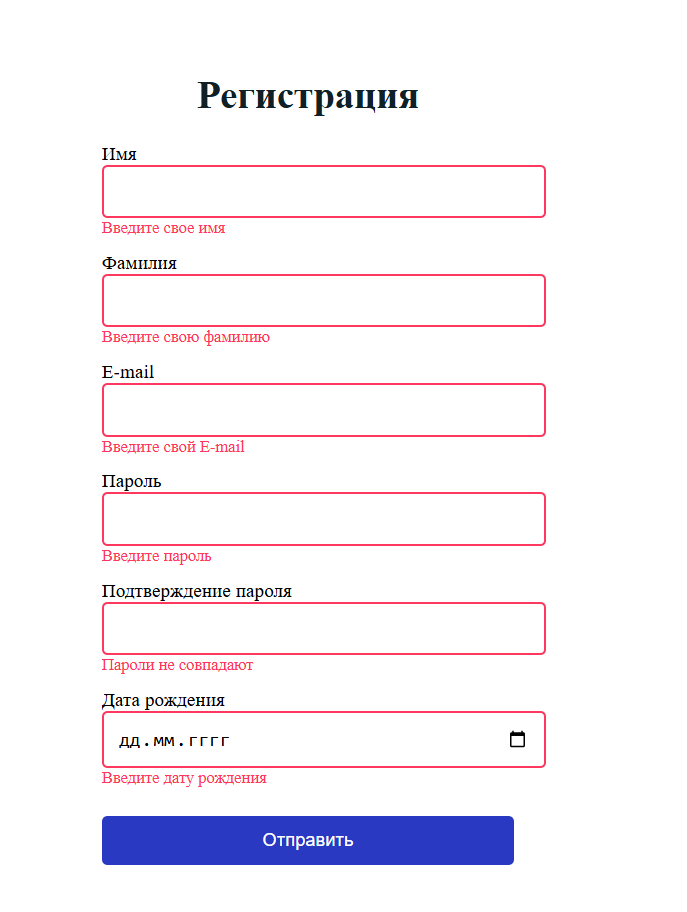
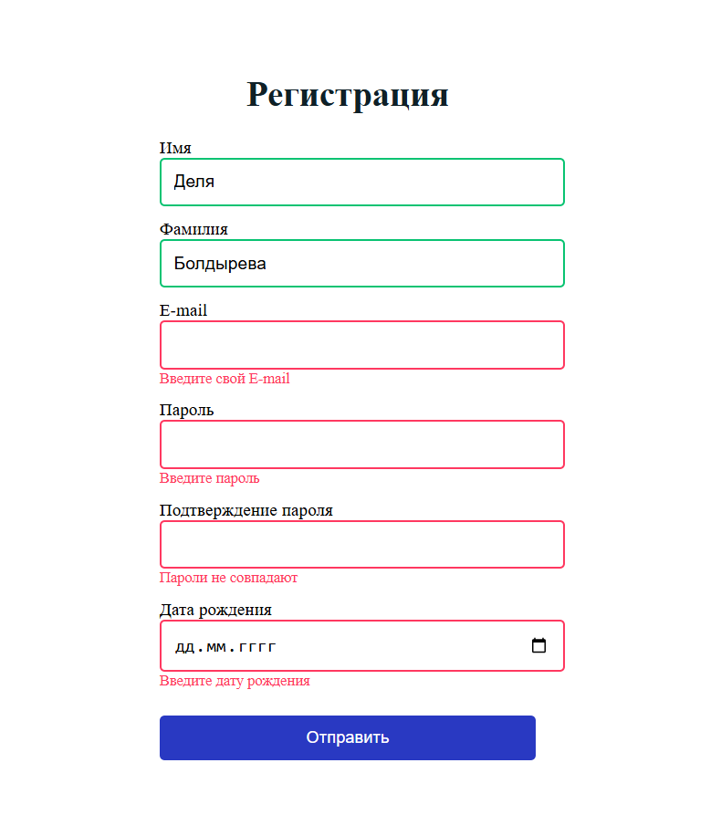
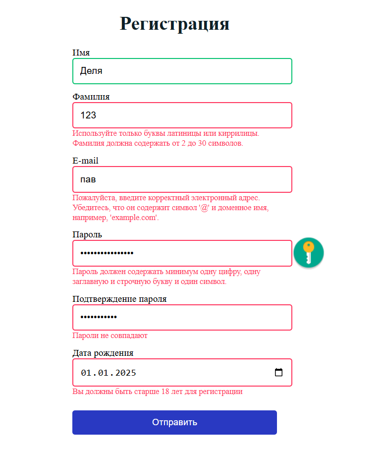

<h2>1. Название проекта</h2>

Form Validation

<h2>2. Описание проекта</h2>

Form Validation - это html-страница с формой регистрации. Проект выполнен в качестве тестового задания.

  <strong>Ссылка на проект</strong>
   
  <a href='https://renadellaa.github.io/Form-validation.github.io/'>Form Validation</a>

<h2>3. Технологии</h2>

  
  
  

<h2>4. Требования</h2>
<ol>
  <li>Реализовать html-страницу с формой регистрации. Список полей формы:
    <ul type='disc'>
      <li>Имя</li>
      <li>Фамилия</li>
      <li>Email</li>
      <li>Пароль</li>
      <li>Подтверждение пароля</li>
      <li>Дата рождения</li>
    </ul>
  Так же должна присутствовать кнопка "Отправить".
  </li>
  <li>Реализовать валидацию полей формы средствами Javascript. Требования к валидации полей формы:
    <ul type='disc'>
      <li>Поля Имя и Фамилия содержат только допустимые символы для имени и фамилии и должны иметь адекватное ограничение по длине.</li>
      <li>Поле Электронный адрес должно содержать только валидный email-адрес.</li>
      <li>Значения полей Пароль и Подтверждение пароля должны совпадать.</li>
      <li>Минимальная длина пароля 8 символов. Пароль должен содержать минимум одну цифру, по одной заглавной и строчной буквы и один символ.</li>
      <li>Возраст пользователя на момент регистрации в форме должен быть не младше 18 лет.</li>
      <li>Пользователь должен иметь возможность понять ошибку(и) и исправить их с минимальным количеством попыток.</li>
    </ul>
  </li>
</ol>
<h2>5. Процесс создания</h2>

Работа разделена на 3 этапа:

<ol>
  <li>Верстка форм.</li>
  <li>Добавление стилей при помощи CSS3.</li>
  <li>Написание Javascript кода для проверки форм на валидность и подсказок пользователю, что нужно исправить прежде чем форма отправится.</li>
</ol>
<h2>6. Функционал</h2>

  
Все input обязательны для заполнения

  

  
При правильном заполнении, форма горит зеленым. Если в форме ошибка, поле горит красным

  

  
При возникновении ошибки, пользователю высвечивается красным сообщение о том, как исправить ошибку

  

<h2>7. Планы по улучшению</h2>
<ol>
  <li>Добавить возможность просмотра пароля.</li>
</ol>
